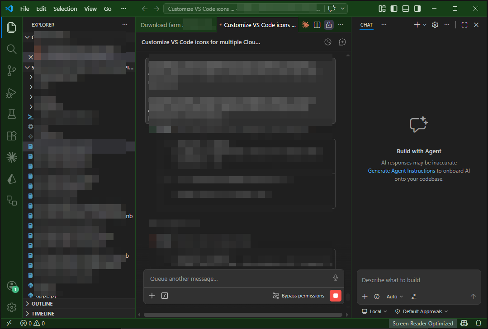
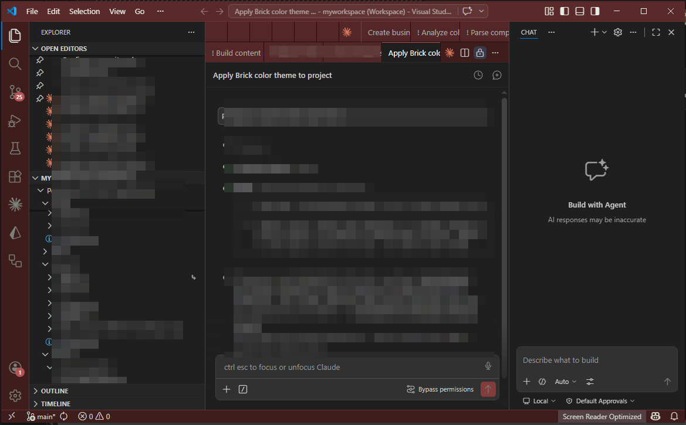

# claude-code-colorize-project

> Tint your VS Code window chrome per project so you can tell parallel Claude Code sessions apart at a glance.

[](https://opensource.org/licenses/MIT)


A [Claude Code](https://claude.com/claude-code) skill that paints VS Code window chrome (title bar, activity bar, status bar, tabs, user-message bubbles) in a chosen color, leaving the editor and chat content neutral gray. Twenty hand-picked dark presets, or any custom hex.


*Forest preset on a Claude API tutorial workspace.*


*Brick preset on a multi-root portfolio workspace. Note the `(Workspace)` indicator in the title — the skill handles both folder mode and `.code-workspace` mode.*

## The pain this solves

When you use Claude Code to work on several projects in parallel, you end up with four, five, eight VS Code windows open at once. They all share the same VS Code icon in the taskbar. `Alt+Tab` previews look identical. Hovering over the taskbar shows you the title text — which you have to *read*, and that breaks flow.

You waste seconds every time you switch. Worse, you sometimes type the wrong thing into the wrong window before you notice.

A colored frame fixes this without occupying any real estate inside the window. Your brain quickly learns *"brick-red = client portal, forest-green = API tutorial, royal-blue = mobile app"*. `Alt+Tab` becomes muscle memory. Taskbar previews give instant recognition. The same skill, applied to a new project, gives you a fresh color you'll associate with it from day one.

The interior — editor, notebooks, Claude chat content — stays untouched. Only the frame is tinted. Code reads the same, syntax highlighting is unaffected.

## What it does

When you ask Claude Code `«раскрась проект»` / `colorize this project` / `/colorize-project`, the skill:

1. Asks you to pick a color from a palette of 20 dark presets via `AskUserQuestion` (or accepts a custom hex you supply).
2. Algorithmically derives 10 shades from the base color (title, frame, accent, etc.).
3. Writes ~50 VS Code color tokens to `.vscode/settings.json` in the current workspace folder.
4. Auto-detects `.code-workspace` files in the folder and updates their `"settings"` block too — so the colors work whether you open the project as a folder or via the multi-root workspace file.

VS Code applies the changes on the fly — no reload required in most cases.

## Palette

20 dark, distinguishable colors (pass the name as `-Color`):

| Name | Hex | Name | Hex |
|---|---|---|---|
| `forest` | `#163f17` | `crimson` | `#5a142a` |
| `royal-blue` | `#1a3a6a` | `steel-blue` | `#2a3a4a` |
| `royal-purple` | `#3f1a55` | `navy` | `#14275a` |
| `burgundy` | `#5a1a1a` | `rust` | `#5a2a14` |
| `amber` | `#5a3a14` | `plum` | `#3a1a3a` |
| `teal` | `#144a4a` | `pine` | `#144a3a` |
| `deep-cyan` | `#144d5a` | `slate-purple` | `#2a1a3a` |
| `indigo` | `#2a1a55` | `brick` | `#5a2a2a` |
| `dark-magenta` | `#4a154a` | `dark-pine` | `#1a3a2a` |
| `olive` | `#3a3a14` | `charcoal-blue` | `#1a2a3a` |

Or pass any custom hex: `#2a4f3c`.

## Installation

Clone into your Claude Code skills directory.

**Windows** (PowerShell):
```powershell
git clone https://github.com/collagerai/claude-code-colorize-project.git "$env:USERPROFILE\.claude\skills\colorize-project"
```

**macOS / Linux** (bash):
```bash
git clone https://github.com/collagerai/claude-code-colorize-project.git ~/.claude/skills/colorize-project
chmod +x ~/.claude/skills/colorize-project/scripts/apply-colors.sh
```

Claude Code picks the skill up automatically the next time you start a session. Verify by asking "what skills are available" in a session, or check `~/.claude/skills/colorize-project/` exists.

**Requirements**
- Windows: PowerShell (preinstalled)
- macOS: bash + `python3` (preinstalled since macOS 12.3+; if missing, `brew install python3`)
- Linux: bash + `python3` (preinstalled on most distros; `apt install python3` / `dnf install python3` otherwise)

## Usage

In any Claude Code session:

| You say | What happens |
|---|---|
| `раскрась проект` / `colorize this project` | Claude shows the palette via `AskUserQuestion`, applies your pick |
| `раскрась этот проект в navy` / `make this navy` | Applies `navy` directly |
| `/colorize-project royal-blue` | Applies `royal-blue` |
| `/colorize-project #2a4f3c` | Applies your custom hex |
| `покажи цвета` / `show palette` | Claude lists the palette with hex codes |

You can also call the script directly without Claude.

**Windows** (PowerShell):
```powershell
# Folder mode (auto-detects .code-workspace files inside)
powershell -ExecutionPolicy Bypass `
  -File "$env:USERPROFILE\.claude\skills\colorize-project\scripts\apply-colors.ps1" `
  -Color royal-blue `
  -WorkspacePath "C:\path\to\your\project"

# Workspace-file mode
powershell -ExecutionPolicy Bypass `
  -File "$env:USERPROFILE\.claude\skills\colorize-project\scripts\apply-colors.ps1" `
  -Color burgundy `
  -WorkspaceFile "C:\path\to\your\project\my.code-workspace"
```

**macOS / Linux** (bash):
```bash
# Folder mode
~/.claude/skills/colorize-project/scripts/apply-colors.sh \
  --color royal-blue \
  --workspace-path ~/path/to/your/project

# Workspace-file mode
~/.claude/skills/colorize-project/scripts/apply-colors.sh \
  --color burgundy \
  --workspace-file ~/path/to/your/project/my.code-workspace
```

Pass both parameters at once to update both targets.

## What gets colored / what stays neutral

**Colored** (in shades of the chosen color):
- Title bar
- Menu bar (selection highlight)
- Activity bar (left icon strip) and its badge
- Auxiliary bar (right Claude panel chrome)
- Status bar
- Tab strip background
- Inactive tabs
- Top accent stripe on the active tab
- User-message bubbles in the chat (`chat.requestBackground`)

**Untouched** (stays default Dark Modern `#1f1f1f` gray):
- The editor itself
- Notebook cells
- Claude chat content area
- Active tab body (only the top stripe is colored)
- Terminal
- Bottom panel (Debug Console, Output)
- Side bar / Explorer (intentional — see below)

## Design notes

### Why `sideBar.background` stays neutral
Claude Code's chat content area uses the same `sideBar.background` token as the Explorer panel. If we tinted it, the chat session would become hard to read. Trade-off: the Explorer stays gray, but the chat stays readable. We accept this.

### Why direct `[System.IO.File]::WriteAllText`, not the standard config write path
Some Claude Code environments have a `PostToolUse` hook that strips certain workbench color tokens when written through the `Write` tool. Symptoms: half the frame gets colored, the other half stays gray. The PowerShell script writes raw bytes via `[System.IO.File]::WriteAllText`, which slips past the hook.

### Multi-root workspaces
When you open a project via a `.code-workspace` file, VS Code ignores `.vscode/settings.json` for chrome colors and reads them from the workspace file's `"settings"` block instead. The script auto-detects `.code-workspace` files inside the target folder and writes to them too, so coloring works regardless of how you open the project.

### Live apply, no reload
VS Code watches `settings.json` and `.code-workspace` files in real time. Color changes appear immediately. If for some reason they don't — `Ctrl+Shift+P` → `Developer: Reload Window`.

### Existing settings preserved
The script reads existing `settings.json` (or `.code-workspace`), replaces *only* the `workbench.colorCustomizations` key, and writes everything else back as-is. Your Python interpreter, ESLint config, workspace `folders` array — all preserved.

## Shade derivation algorithm

The base hex you choose becomes `titleBar.activeBackground`. Other shades are derived by linear scaling of RGB channels:

| Purpose | Multiplier |
|---|---|
| title inactive | × 0.76 |
| title border | × 1.18 |
| menubar selection | × 1.35 |
| frame bg (activity / status / tabs strip) | × 0.70 |
| aux bg (Claude panel) | × 0.55 |
| tab inactive / chat bubble | × 0.92 |
| tab border | × 0.35 |
| tab hover | × 1.15 |
| **accent** (badge / activeBorderTop) | dominant channel → 180, others lifted proportionally, min 60 |

All channels clamped to 0–255. The "vibrant accent" formula produces a saturated brand-style highlight: green base → mint accent, blue → bright sky, purple → magenta.

## Platform

Works on **Windows**, **macOS**, and **Linux**. Two equivalent scripts — same palette, same shade algorithm, same write logic. The skill auto-routes to the right one based on the host OS.

## Files

```
colorize-project/
├── SKILL.md                    # Skill definition for Claude Code
├── scripts/
│   ├── apply-colors.ps1        # PowerShell engine (Windows)
│   └── apply-colors.sh         # bash + python3 engine (macOS / Linux)
├── screenshots/
│   ├── example-forest-green.png
│   └── example-brick-red.png
├── README.md
└── LICENSE
```

## License

MIT — see [LICENSE](LICENSE).

---


